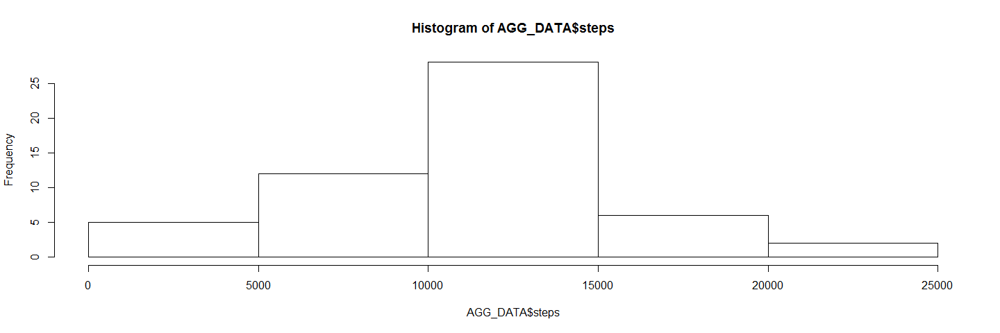
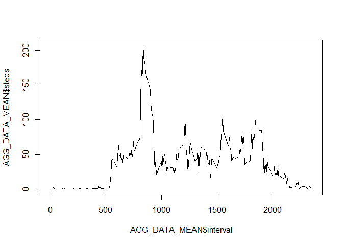
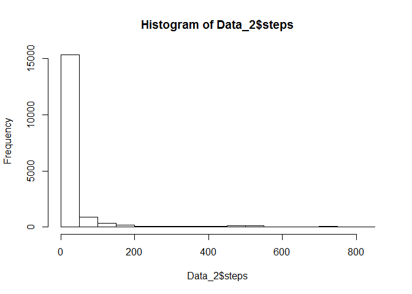
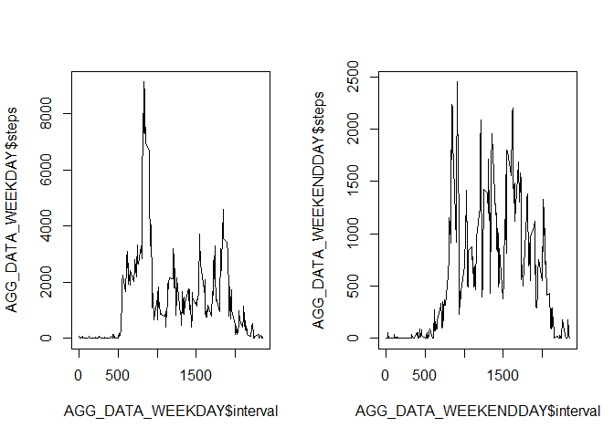

# Reproducible Research: Peer Assessment 1


## Loading and preprocessing the data
	1. Unzip the compressed file
	2. Load the CSV file
	3. Convert Date column to Date format
	

```r
	unzip("repdata-data-activity.zip")
```

```
## Warning in unzip("repdata-data-activity.zip"): error 1 in extracting from
## zip file
```

```r
	Data <- read.csv("C:\\Users\\Kawthar\\Documents\\Data Science\\Reproducible Research\\Week 2\\project\\activity.csv")
	Data$date <- as.Date(Data$date, "%Y-%m-%d")
```


## What is mean total number of steps taken per day?

1. Aggregate the data on interesting variables and calculate the mean

```r
	AGG_DATA <- aggregate(steps ~ date, data=Data, FUN=sum, na.rm=TRUE)
```
2. Plot the histogram

```r
	hist(AGG_DATA$steps)
```

 
3. Calculate Mean and Median


```r
	MEAN <- mean(AGG_DATA$steps, na.rm=FALSE)
	MEDIAN <- median(AGG_DATA$steps, na.rm=FALSE)
```


## What is the average daily activity pattern?

1. Calculate mean value 
 

```
## [1] 835
```

## Imputing missing values


```
## [1] 2304
```

 


```r
	COUNT_NA <- sum(is.na(Data$steps))
	COUNT_NA
```

```
## [1] 2304
```

```r
	Data_2 <- Data
	Data_2$steps[is.na(Data_2$steps)] <- 0
	hist(Data_2$steps)
```

 
## Are there differences in activity patterns between weekdays and weekends?


```r
	par(mfrow=c(1,2))
	plot(AGG_DATA_WEEKDAY$interval, AGG_DATA_WEEKDAY$steps, type="l")
	plot(AGG_DATA_WEEKENDDAY$interval, AGG_DATA_WEEKENDDAY$steps, type="l")
```

 
